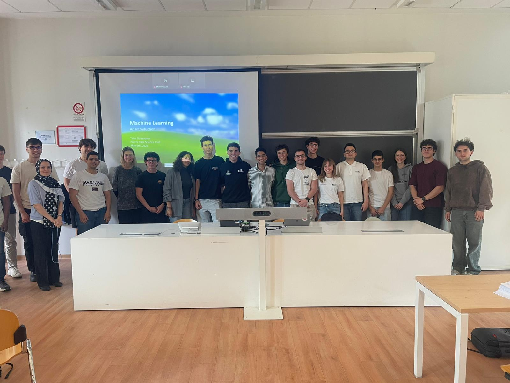

# Politecnico di Milano Workshop

|  | ![with him][./art/alpha.jpg] |

Practical workshop on machine learning at [POLIMI](https://www.polimi.it/) in a collaboration with [PMDS](https://polimidatascientists.it/). 

## Google Colab

Google Colab (short for Colaboratory) is a free, cloud-based service from Google that allows users to write and execute Python code directly in their browser. It is a hosted version of Jupyter Notebook that requires zero setup, offering free access to powerful computing resources like GPUs (Graphics Processing Units) and TPUs (Tensor Processing Units).

In order to start coding just type in the browser: [colab.new](https://colab.new).

## Topics Covered

- Definitions
- Standardization
- Objectives
- Train–Test–Split
- Loss Functions
- Over-fitting
- Ridge & Lasso
- Parameters & Hyper-parameters
- Clustering
- Reproducibility
- Ensembles
- Deep Learning
